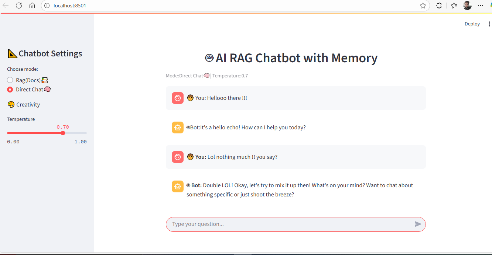
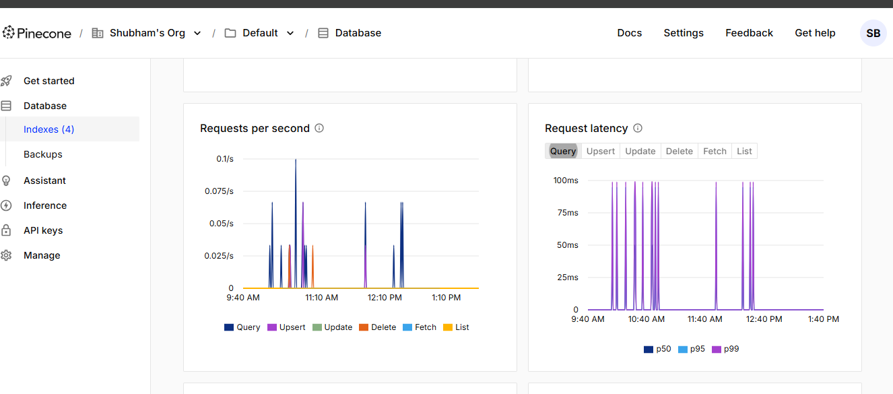
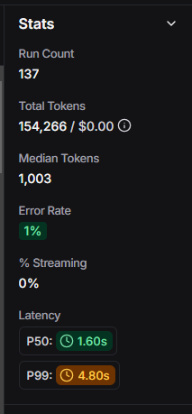
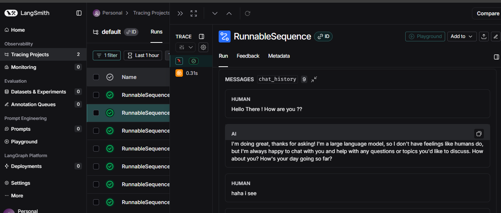
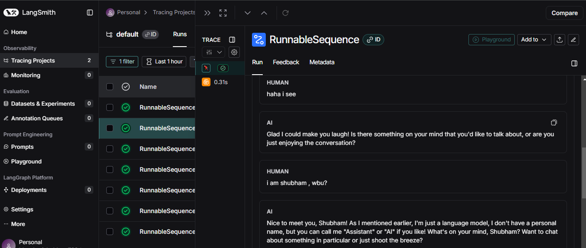
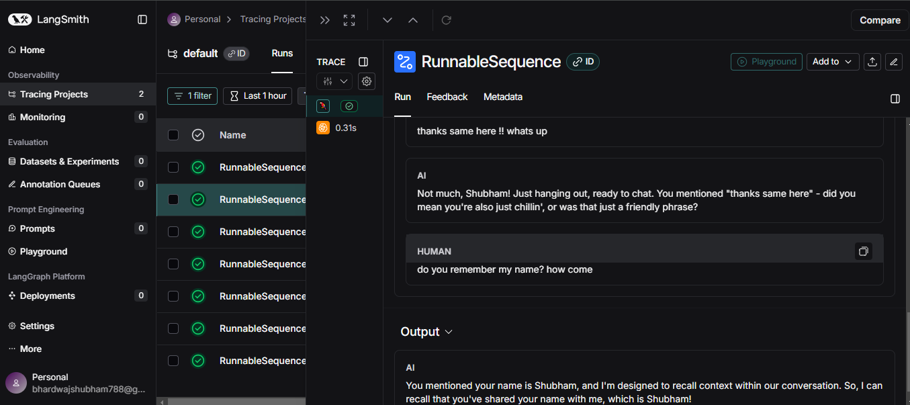
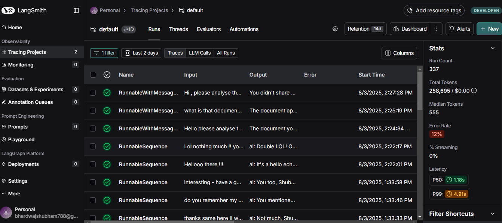
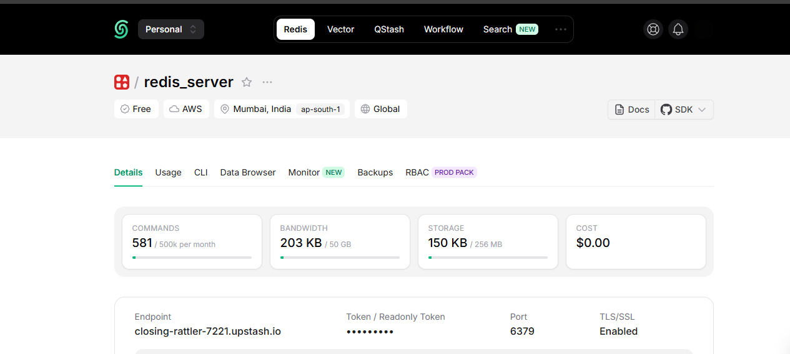

Project Name : AI chatbot with memory :

This is a streamlit based AI chatbot application that allows you to : 
 
Functionality:
-Upload documents (pdf,txt,word doc) and chat with their content using RAG (Retrieval Augmented Generation).
-User can also chat directly if they wish to not provide any documents.
-The chatbot can also remember past conversations well and can refer to previous context as well
-Caching is present throughout the bot to avoid recomputing already retreiver results.

Features:
-RagMode- Upload any documents pdf,text or Doc file to chat with the bot and ask queries regarding the content in files.
-Progress indicator is present for RagMode so user can see the processing,chunking,embedding and retrieval highlights at run time display once documents are uploaded.
-Direct mode - If you wish to chat with the bot without any file to upload- you can chat using direct chat mode .
-Throughout both the modes mentioned above - bot will be able to remember context and maintain a chat history for better conversation experience.

TechStack:
-python 3.10 with conda (venv)- Avoided the use of 3.11 or 3.12 versions so to avoid any app crashes if in case langchain modules is not supported.Used conda venv to avoid clashes between env variables.
-Langchain - To build the RAG pipeline by using imports of various required modules.
-Redis (Upstash)- Upstash version for redis is used so that we have a 24x7 running server witout on cloud.
-Pinecone- Pinecone vector store for managed database using index creation- client 3.22.0.
-ChatGroq- For fast inference and used model:'meta-llama/llama-4-scout-17b-16e-instruct'.
-Hugging Face -Used Sentence Transformers embeddings from Hugging Face platform to create embeddings for our documents.
-API keys- Used API keys from Pinecone-for vector db, HuggingFace(not used in project) , Groq-for inference and Langchain-Langsmith-Tracing for evaluation.

Usage,Performance and Testing:

-The bot perfomed well with the Usage part and was able to retain context as well. Here is a sample screenshot below where i chatted in direct mode and rag mode with the bot and for both it was able to perfom as expected with history retained in memory and context as well.
Direct mode screenshot-

-Overall for both the modes the bot performed quite well with max query latency score of 99ms fluctuated till 50ms as well and throughout the session it stayed even lower closer to 10. Below are the screenshots of same via pinecone vector store platform.

-Testing
Throughout the development - i personally kept testing the bot specially after the UI was created using streamlit to see if it works upto the expectations or not .
Below is the screenshot from Langsmith tracing where i have tried multiple prompts spanning across multiple sessions and tried different prompts or methods to find patterns where it fails to perform .
Tracing all tests run count-
Tracing session ss:1-
Tracing session ss:2 
Tracing session ss:3 

ChallengesFaced:
-Being True, throughout the project the major challenge i faced was to integrate everything with the streamlit app ui.
I understand the interface is very smooth and easy to work with but being new to it - i faced trouble in working with session state history by first understanding what it is , how it works and to implement it after combining all things together.
-I took the help from internet and various open source platforms to work with the ui part and club everything together.
-I also faced errors during testing and debugged them by using open source websites and searched for the errors one by one .
Here is sample screenshot - from my testing phase where i ran a lot of queries just to improvise functionality and added memory features and updated session histories through out by seeing what the bot lacks feature by feature. Got an error rate of 12 percent when averaged for 2 days and ran around 320 runs to improvise the model.

While there are many additional features that could further enhance the chatbot, I have implemented this project to the best of my current knowledge and skills. I take pride in delivering original work without copying from other platforms or presenting work that is not my own.

The main challenges I encountered during development were primarily related to integrating various components and managing session state in Streamlit. Beyond these, the project was a valuable learning experience—starting from understanding RAG concepts, implementing them in notebooks, and eventually building a full UI-based application. Overall, it was an enjoyable and rewarding journey.

Thanks for reading !!!

Extras:
redis server used - 

